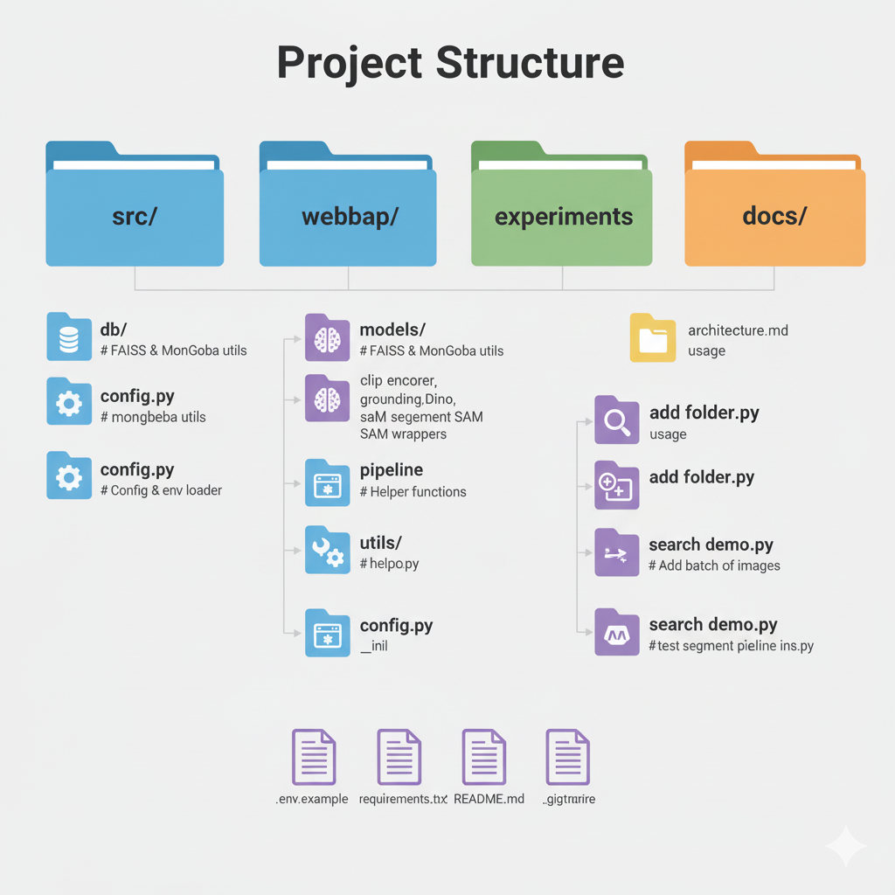
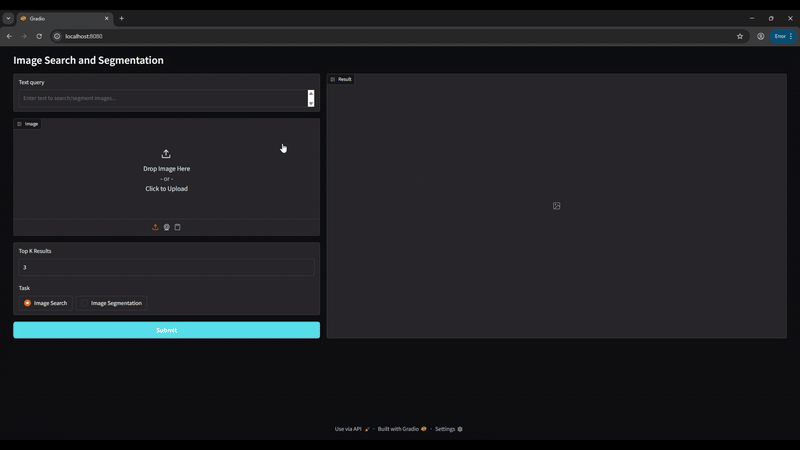

# 🚀 Image Search & Segmentation WebApp

A multimodal AI project that enables **image search using text, image, or text+image queries**, combined with **object detection and segmentation** for fine-grained search.  

Built with **CLIP, FAISS, MongoDB, GroundingDINO, SAM, and Gradio**.  

---

## 📌 Features
- 🔍 **Image Search**  
  - Search images by **text** (e.g., `"fighter jet"`).  
  - Search images by **image** (find visually similar images).  
  - Search images by **text + image** for fine-grained queries.  

- 🎯 **Object-centric Search**  
  - Upload an image + provide a text prompt (e.g., `"car"`, `"jet fighter"`).  
  - Detect and segment the object of interest (GroundingDINO + SAM).  
  - Use the segmented object as the query to search similar objects.  

- ⚡ **Efficient Retrieval**  
  - **FAISS** stores image embeddings for fast similarity search.  
  - **MongoDB** stores metadata (file path, object info, attributes).  

- 🌐 **Interactive WebApp**  
  - Built with **Gradio** for quick demo and user-friendly UI. 

## 📂 Project Structure


## ⚙️ Installation
```
git clone https://github.com/syvt201/text-image-product-search.git
cd text-image-product-search

# Create environment
conda create -n image-search python=3.10
conda activate image-search

# Install dependencies
pip install -r requirements.txt
```

## 🔧 Setup
**1.** Copy `.env.example` ➝ `.env` and update values (e.g., MongoDB URL, FAISS index path).

**2.** Build FAISS index and MongoDB collections:
```
python -m src.pipeline.build_index
```

**3.** Run the webapp:
```
python -m webapp.demo.py
```

## 🖥️ Demo

### Here’s how the Gradio UI looks:


### 🔍 Search by Text


### 🎯 Segment + Search